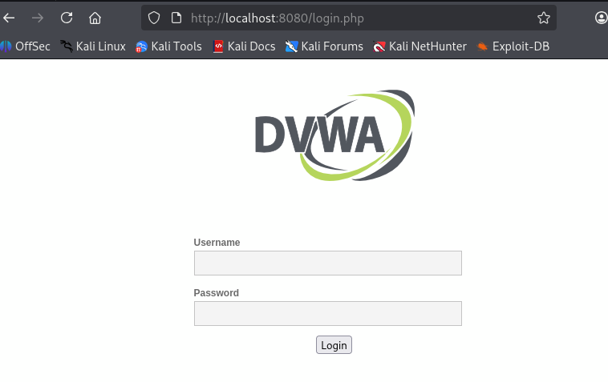
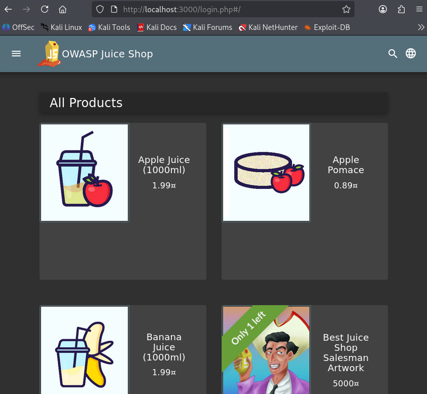
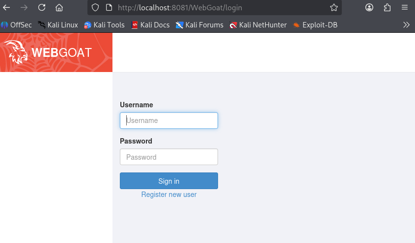

# Laboratorio de Hacking Ético con Docker

Este repositorio contiene la configuración y documentación de mi laboratorio personal de hacking ético utilizando contenedores Docker. Aquí documentaré cada máquina vulnerable, los comandos utilizados y los hallazgos obtenidos.

## Requisitos Previos

- Docker instalado ([Guía oficial](https://docs.docker.com/get-docker/))
- Docker Compose (opcional pero recomendado)
- Kali Linux (o cualquier distribución de pentesting)

 Laboratorios Desplegados

### 1. DVWA (Damn Vulnerable Web Application)

**Comando de despliegue:**
```bash
sudo docker run --rm -d -p 8080:80 vulnerables/web-dvwa
```
En el navegador
http://localhost:8080
Credenciales por defecto
* Usuario: admin
* Contraseña: password

## Capturas

### DVWA



### 2. OWASP Juice Shop
**Comando de despliegue**
```bash
sudo docker run --rm -d -p 3000:3000 bkimminich/juice-shop
```
En el navegador
http://localhost:3000
Descripcion: Tienda online moderna con vulnerabiliades realistas

###  Juice Shop



### 3. OWASP WebGoat
**Comando de despliegue**
```bash
sudo docker run --rm -d -p 8081:8080 -p 9090:9090 webgoat/goatandwolf
```
En el navegador
http://localhost:8081/WebGoat
WebWolf (auxiliar): http://localhost:9090/WebWolf

### WebGoat


### Comandos Utiles
**Ver contenedores en ejecucion**
```bash
docker ps```

**Detener todos los contenedores**
```bash
docker stop $(docker ps -aq)```

**Ver logs de un contenedor**
```bash
docker logs [ID_CONTENEDOR]```

**Acceder a la terminal de un contenedor**
```bash
docker exec -it [ID_CONTENEDOR] /bin/bash```

### Documentacion de ataques
## DVWA - Primeros Passos

**Escaneo de puertos con Nmap**
```bash
nmap -p- localhost```

**Descubrir directorios con Gobuster**
```gobuster dir -u http://loacalhost:8080 -w /usr/share/wordlists/dirb/common.txt```

## Hallazgos:
**Directorio expuesto**
```/config/```
**Documentacion**
```/docs/```

**Panel de administracion MySQL**
```/phpmyadmin/```

## Inyeccion SQL Bàsica
En la seccion "SQL Injection" de DVWA:

*Input*
```' OR '1'='1```

*Resultado: Bypass de autenticaciòn*

### Juice Shop - Primeros Hallazgos
```bash
# escaneo de puertos
nmap -p- localhost

# Descubrir andpoints
gobuster dir -u http://localhost:3000 -w /usr/share/wordlists/dirb/common.txt -x js,html,php```


### Proximos objetivos
*Realizar ataques de fuerza bruta con Hydra*
*Explotar vulnerabilidades con Metasploit*
*Documentar XSS en Juice Shop*
*Escalar privilegios en entornos Linux*

### Recursos Ùtiles
*OWASP TOP 10*
*Cheat Sheet de NMAP*
*Payloads de XSS*

### Aviso Legal
Este laboratorio es exclusivamente para fines educativos. No utilice estas tècnicas en sistema sin autorizacion explicita.

### Versiones
*Docker:24.x*
*DVWA: latesl*
*Juice Shop: latest*
*WebGoat: latest*

Creado por: Pietro Grillo
Fechas de inicio: Marzo 2026
Ultima actualizacion: $(date +%d/%m/%Y)
